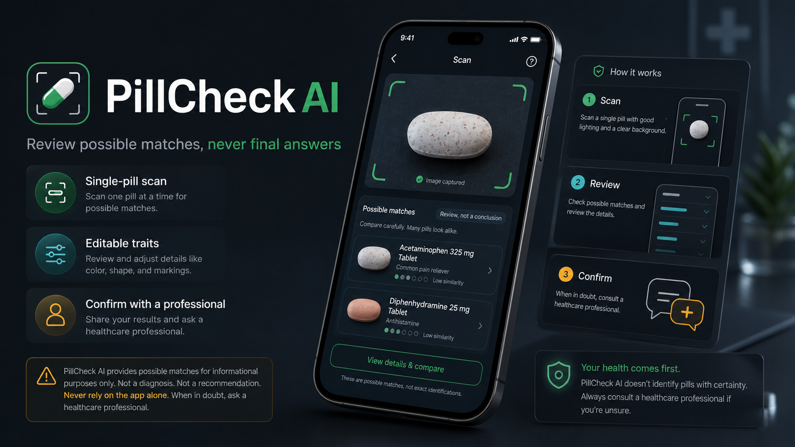

# PillCheck AI

**Live:** https://pillidentify.100dayaichallenge.com



> Product-concept mockup — the app returns possible matches only, never definitive identification or medication safety advice.

PillCheck AI is a mobile-first pill identification assistant. A user can capture or upload a photo of a single pill, review the visible traits extracted from the image, edit those traits, and search structured reference data for possible matches.

## Features

- Browser camera capture with photo upload fallback
- OpenAI vision trait extraction for imprint, shape, color, markings, and photo quality
- Editable confirmation step before matching
- Local scoring algorithm that weights imprint highest and limits confidence when imprint is missing
- Supabase/Postgres reference data, anonymous search history, and feedback
- Safety-first UI that never says a pill is safe to take or definitively identified

## Install

```bash
git clone https://github.com/Still-InFrame/day-38-pillidentify.git
cd day-38-pillidentify
npm install
npm run dev
```

Create `.env.local` with:

```bash
NEXT_PUBLIC_SUPABASE_URL=your-supabase-url
NEXT_PUBLIC_SUPABASE_PUBLISHABLE_KEY=your-supabase-publishable-key
OPENAI_API_KEY=your-openai-api-key
```

## Stack

- Next.js App Router
- TypeScript
- Tailwind CSS
- Supabase/Postgres with RLS
- OpenAI Responses API vision input

## Safety

PillCheck AI is an identification assistant, not a diagnosis, treatment, dosage, interaction, emergency, or medication-decision tool. Results are possible matches only. Always confirm with a pharmacist, doctor, poison control, prescription bottle, or official medication source.

## Links

- Tracker: https://www.100dayaichallenge.com/share/savion
